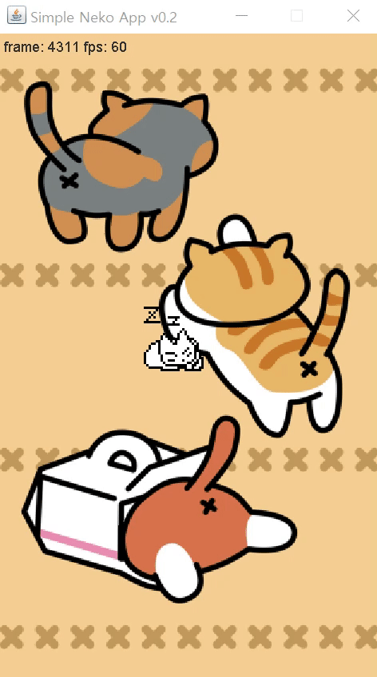

# Neko Java

## Cute Neko Project written in Java

This is the Java GUI exercise program for study.

There may be original Neko project, but I can't find it.

I just download images of Neko and implement this program.

## Run

`net.honux.neko.Box` is the main class of this app.
simply Run `Box.main` method using IDE like IntelliJ IDEA

## Reference

- <https://en.wikipedia.org/wiki/Neko_(software)>